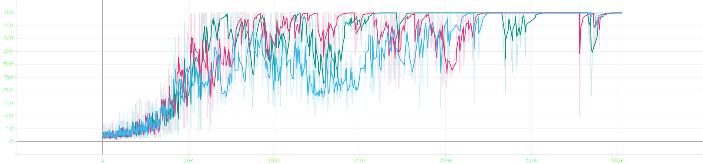
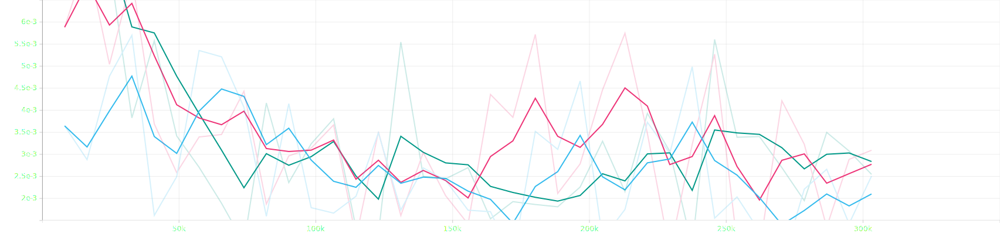
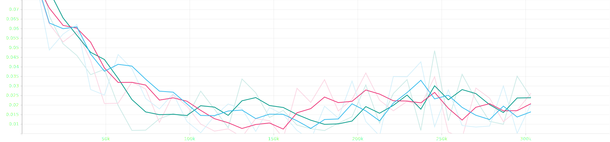
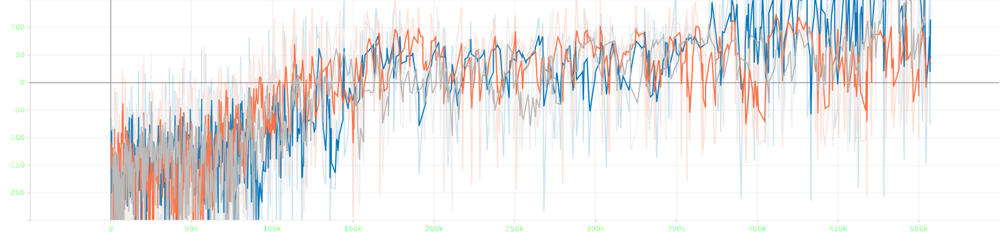
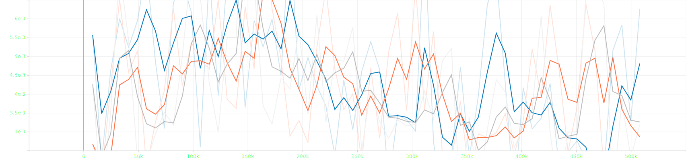
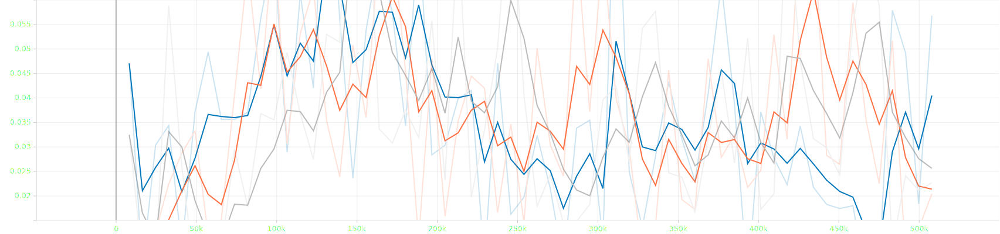

# dear_ender_dragon_v3

**dear_ender_dragon_v3** is a reinforcement-learning project aimed at eventually playing through Minecraft. Minecraft is an open-world, long-horizon environment where rewards are naturally **sparse**, which makes end-to-end learning difficult.  
To make steady progress, this repository follows a **multi-phase** approach: each phase adds complexity while keeping a reproducible, well-tested baseline.

## Project Scope / Philosophy
- **Goal:** build a reliable RL training stack that can be extended toward long-horizon, sparse-reward tasks (Minecraft).
- **Approach:** incremental phases with pinned configs and repeatable results.
- **Baseline-first:** each phase must have a “gold” configuration that is reproducible and acceptance-tested.

## Environment / Platform
Developed and tested on:
- **Python:** 3.11.14
- **OS:** Fedora Linux
- **Hardware:** NVIDIA GPU (CUDA)

Other setups may work but are not currently tested.

---

## Quick Start

### 1) Create and install the environment
```bash
# uv (recommended)
uv venv .venv
uv sync

# OR pip:
python -m venv .venv
source ./.venv/bin/activate
pip install --no-deps .
```

### 2) Run outputs
Runs write artifacts to Hydra output directories:
- `outputs/` for single runs
- `multirun/` for sweep runs

These directories contain TensorBoard event files, checkpoints, and any additional run artifacts.

### 3) View training results in TensorBoard
- Normal runs:
  ```bash
  tensorboard --logdir outputs
  ```
- Multi-runs (Hydra sweeps):
  ```bash
  tensorboard --logdir multirun
  ```

Open: `http://localhost:6006/`

---

## Phase Index
- **Phase 0 (Done):** PPO + MLP baseline on classic control tasks (CartPole, LunarLander)

(Next phases will build on this baseline.)

---

# Phase 0 (Done): PPO + MLP Baseline

## Phase 0 Goal
Produce a **minimal, correct, reproducible** PPO baseline for discrete-action control:
- CartPole learns to near-max return reliably.
- LunarLander learns reliably across multiple seeds.
- Unit tests validate GAE and terminated-vs-truncated handling.
- Runs generate reproducible artifacts (logs/checkpoints) and near-identical curves for the same seed.

## What Phase 0 Includes
- PPO training with an MLP actor-critic.
- Stable learning on:
  - `CartPole`
  - `LunarLander`
- Logging compatible with TensorBoard (see `outputs/` and `multirun/`).

## Run the “Gold” Baselines

### CartPole (gold config)
```bash
python -m scripts.train --config-name train.yaml experiment=cartpole_gold
```

**Test run (seed = 0, 100, 200)**

Episodic return:


Approx KL divergence:


Clip fraction:


### LunarLander (gold config)
```bash
python -m scripts.train --config-name train.yaml experiment=lunarlander_gold
```

**Test run (seed = 0, 100, 200)**

Episodic return:


Approx KL divergence:


Clip fraction:

